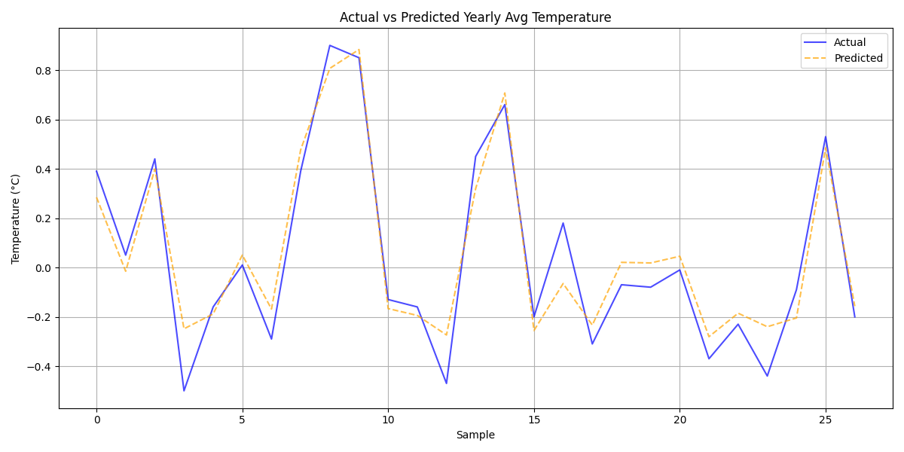

<<<<<<< HEAD

# group 47

# Climate Prediction using LSTM (SDG 13: Climate Action)

## Overview
This project uses deep learning (LSTM neural networks) to analyze and predict climate trends, supporting the United Nations Sustainable Development Goal 13: Climate Action. By forecasting temperature changes with advanced machine learning techniques, the project aims to provide insights into climate patterns and contribute to climate action awareness.

## Project Structure
The project is organized into a README file and a Jupyter notebook that works on:
   - Data loading and preprocessing
   - Sequence creation for time series prediction
   - Data scaling and splitting
   - LSTM model implementation
   - Model training and evaluation
   - Future temperature predictions
   - Interactive data visualization
   - Model performance analysis
   - Temperature trend analysis

## Features
- Advanced LSTM-based deep learning model for time series prediction
- Interactive data visualization and analysis
- Monthly and yearly temperature trend analysis
- Future temperature predictions
- Model performance metrics and visualizations

## Requirements
- Python 3.x
- Jupyter Notebook
- Required packages (install via `pip install -r requirements.txt`):
  - numpy>=1.21.0
  - pandas>=1.3.0
  - scikit-learn>=0.24.2
  - tensorflow>=2.16.1
  - matplotlib>=3.4.3
  - seaborn>=0.11.2
  - jupyter>=1.0.0
  - ipykernel>=6.0.0
  - nbconvert>=7.0.0

## Usage
1. Install the required packages:

3. Each notebook can be run in VSCode with the Jupyter extension or in any Jupyter environment

## Model Architecture
The project uses a sophisticated LSTM (Long Short-Term Memory) neural network with:
- Multiple LSTM layers with dropout for regularization
- Dense layers for final predictions
- Sequence-based input for time series prediction
- MinMaxScaler for data normalization

## Results
- Interactive visualizations of temperature trends
- Model performance metrics (MAE, Loss)
- Future temperature predictions
- Monthly and yearly temperature analysis
- Correlation analysis between different months

## Ethical Considerations
- The model is trained on historical data and may not account for future climate changes
- Predictions should be used for educational and awareness purposes
- Data transparency and model interpretability are maintained
- Regular updates and validation are recommended
- The project promotes climate awareness through accessible data visualization

## Screenshots

## 1-Page Project Summary

**SDG Problem Addressed:**  
Climate change (SDG 13: Climate Action) — Using advanced LSTM neural networks to predict temperature trends and raise awareness about climate change.

**ML Approach Used:**  
Deep learning with LSTM networks for time series prediction, providing more sophisticated analysis than traditional methods.

**Results:**  
- Interactive visualizations of temperature trends
- Future temperature predictions
- Comprehensive analysis of monthly and yearly patterns
- Model performance tracking with loss and MAE metrics

**Ethical Considerations:**  
- Transparent data processing and model architecture
- Educational focus on climate awareness
- Regular model validation and updates recommended
- Open-source implementation for community contribution
- Emphasis on data visualization for better understanding

---
